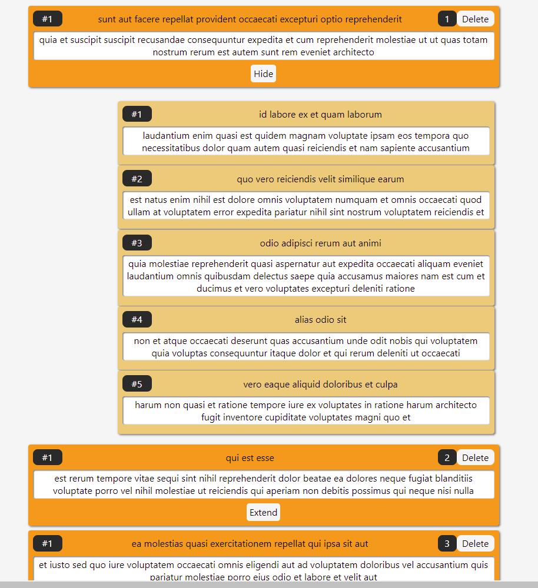

Technical Test developed by José Luis Aparicio for Cleverpy
https://cleverpy.com/

Check more projects at:
https://github.com/ApcarJo

Date started 01/09/2021
Date finished 02/09/2021

Tools & Coding Languages

- Javascript
- React
- Typescript
- Axios
- Sass

Download the zip file and install dependencies: 'npm i'
Run: 'npm start'

Home page will show every post on http://jsonplaceholder.typicode.com/

Extend button allows you to check every comment of the selected post, this comments will be shown under the current post.

Delete buttons will erase the post from the view. You will need to refresh website to get again all the posts from JSONPlaceholder.

